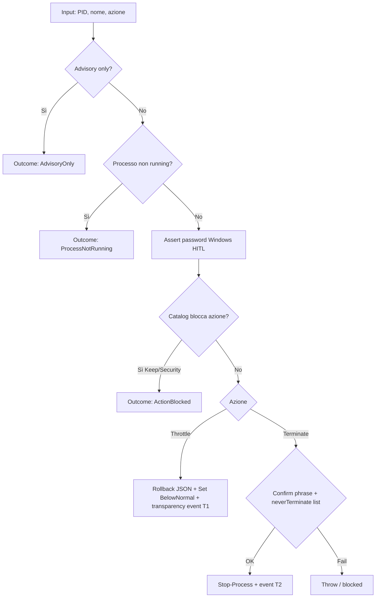
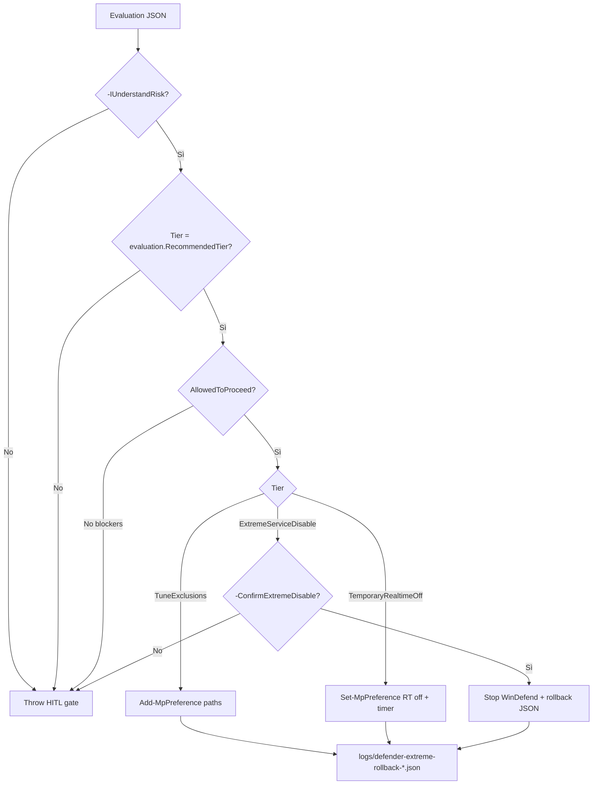
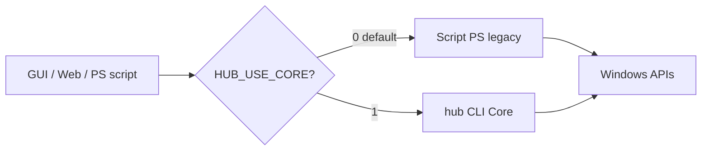

# Hub Phase 3 — Tre path HITL: cosa fanno, come decidere

> **Stato:** 2026-09-01 · Hub Core **0.6.0** · Phase 2 read-only **done** · Phase 3 **blocked (HITL)**

Documento di riferimento per decisioni **data-driven**, **deterministiche** e **best-effort** sui tre path che richiedono approvazione operatore prima dell’automazione.

---

## I tre path (panoramica)

| # | Path | Deliverable | Stato oggi | Mutazione OS |
|---|------|-------------|------------|--------------|
| 1 | **Resolve apply** | `hub resolve apply` | Core: solo `plan` (dry-run). Live: **solo PS** | Sì — priorità processo, terminate |
| 2 | **Defender apply** | `hub defender apply` | Core: solo `evaluate`. Apply: **solo PS** | Sì — esclusioni AV, real-time off, stop servizio |
| 3 | **HUB_USE_CORE** | Flag env su orchestratori PS | **Non implementato** negli script (solo design doc) | Indiretta — instrada verso Core invece di PS |

I path 1 e 2 sono **funzionalità** da portare in C#.  
Il path 3 è il **meccanismo di rollout** per usare Core in produzione senza big-bang.

---

## Session HITL (2026-09-01 — operatore)

**Una password all'apertura sessione (~45 min), non per ogni azione.**

| Step | Dove |
|------|------|
| 1 | Control tab → **HITL Paths...** → **Sblocca sessione** (password + 3 checkbox consapevolezza) |
| 2 | Scegli path 1/2/3 dal pannello (use case spiegato) |
| 3 | Azioni successive usano `sessionToken` (GUI, web, CLI `hub auth session-start`) |

Legacy: password per azione ancora accettata via API ma deprecata.

## Soglie composite Defender (max deterministico)

Teorico max composite ≈ **100**. Tier alzati al massimo prudente:

| Tier | minComposite | max |
|------|--------------|-----|
| Observe | 0 | 84 |
| TuneExclusions | **85** | 89 |
| TemporaryRealtimeOff | **90** | 94 |
| ExtremeServiceDisable | **95** | 100 |

GUI prompt Defender: `MinCompositeScoreForPrompt` = **85** (`sys-maintenance.json`).

---

## Path 1 — `hub resolve apply` (live throttle / terminate)

### Cosa fa

Applica azioni su **un processo live** dopo advisory + policy:

| Azione | Effetto OS | Reversibilità |
|--------|------------|---------------|
| `ThrottleBelowNormal` | `Process.PriorityClass = BelowNormal` | Sì — rollback JSON con `PreviousPriority` |
| `Terminate` | `Stop-Process -Force` | **No** — irreversibile |
| `MarkWorkNecessary` / `MarkUnneeded` | Scrive `KB/operator-process-decisions.json` | Sì — decisione operatore |
| `Observe` | Nessuna mutazione | N/A |

### Come lavora oggi (PS — `resolve-unknown-process.ps1`)



**Gate HITL obbligatori (PS, e stessi in Core apply):**

1. Password Windows verificata (`LogonUser` / `hub auth verify`)
2. Catalogo: `Keep` blocca throttle/terminate (es. `MsMpEng`)
3. `NeverTerminateExact` in `process-resolution.json` (es. `System`)
4. Terminate: confirm phrase esatta (`STOP UNKNOWN` default)
5. Transparency: evento in `logs/transparency-events.jsonl`
6. Throttle: rollback file `logs/process-resolution-rollback-*.json`

**Core oggi:** `hub resolve plan` + **`hub resolve apply`** (session HITL). PS resta orchestrator default.

### Score NBD (`phase3-resolve-apply`)

| Dimensione | Score | Interpretazione |
|------------|-------|-----------------|
| ParityFeasibility | 70 | Portabile, ma auth + rollback + live PID |
| RegressionRiskInverse | **30** | **Rischio alto** — kill processo sbagliato |
| UserValue | 95 | Alto — chiude loop operatore GUI/web |
| GateReadiness | **25** | Serve parity apply + test live controllati |
| EffortInverse | 50 | Medio |

### Pro

- Risolve il caso d’uso principale PPI: processo unknown/high-RAM → azione reversibile
- Throttle è **reversibile** con rollback documentato
- Policy catalog già testata in parity (`ActionBlocked`, `NeverTerminate`)
- Core `plan` già in parity con PS

### Contro

- Terminate è **irreversibile** — errore = downtime applicazione
- Race: PID riusato tra advisory e apply
- Richiede password in chiaro (file temp) — superficie attacco locale
- `GateReadiness` 25: mancano test apply end-to-end in Core

### Segnali GO (tutti richiesti)

- [ ] `test-core-parity.ps1` esteso: apply throttle su processo test + rollback
- [ ] `test-hub-smoke.ps1`: `hub resolve apply --dry-run` parity con PS
- [ ] Nessun drift su `ActionBlocked` / `NeverTerminate` / confirm phrase
- [ ] Operatore accetta rischio terminate su path non-vitali only

---

## Path 2 — `hub defender apply` (tier extreme necessity)

### Cosa fa

Applica tier da valutazione `DefenderExtremeNecessityEvaluation` quando MsMpEng/Defender satura risorse:

| Tier | Composite ≥ | Azione | Rischio sicurezza |
|------|-------------|--------|-------------------|
| `Observe` | — | Nessuna | Nessuno |
| `TuneExclusions` | 55 | `Add-MpPreference -ExclusionPath` | Basso — AV resta attivo |
| `TemporaryRealtimeOff` | 70 | `DisableRealtimeMonitoring` (max 60 min) | **Alto** — finestra senza RT scan |
| `ExtremeServiceDisable` | 85 | `Stop-Service WinDefend` (max 120 min) | **Critico** — AV disabilitato |

### Come lavora oggi (PS — `apply-defender-extreme-necessity.ps1`)



**Gate HITL obbligatori:**

1. `#Requires -RunAsAdministrator`
2. `-IUnderstandRisk` (prima conferma esplicita)
3. Tier deve **coincidere** con `RecommendedTier` dell’evaluation
4. `AllowedToProceed = true` (no blockers: admin, module, tamper protection, MsMpEng in report)
5. `ExtremeServiceDisable`: **seconda** conferma `-ConfirmExtremeDisable`
6. `ReasonCode` obbligatorio (`DevBuild`, `EmergencyPerf`, …)
7. Rollback JSON + `restore-defender-from-rollback.ps1`

**Core oggi:** `hub defender evaluate` — read-only, parity tier/composite con PS.

### Score NBD (`phase3-defender-apply`)

| Dimensione | Score | Interpretazione |
|------------|-------|-----------------|
| ParityFeasibility | 55 | WMI/Defender cmdlet + timer re-enable |
| RegressionRiskInverse | **15** | **Rischio massimo** — disabilita AV |
| UserValue | 75 | Utile solo in emergenza MsMpEng |
| GateReadiness | **20** | Tamper Protection, rollback, admin |
| EffortInverse | 40 | Complesso |

### Pro

- Unico percorso **deterministico** per pressione Defender estrema (composite score)
- Tier ladder graduale — preferisce esclusioni prima di disable
- Rollback e reason code obbligatori — audit trail
- Evaluation già in parity Core ↔ PS

### Contro

- **Tamper Protection** blocca tier 2+ finché disabilitato manualmente
- Disabilitare AV espone host durante finestra time-boxed
- Errori di path esclusione = zone non scansionate permanenti fino a rollback
- RegressionRiskInverse **15** — il più basso dei tre path
- Non risolve la causa root (build path, scan schedule) — solo sintomo

### Segnali GO (tutti richiesti)

- [ ] Evaluation live con MsMpEng in top PPI (non synthetic only)
- [ ] Tamper Protection gestito esplicitamente in runbook
- [ ] Test rollback `restore-defender-from-rollback.ps1` su VM
- [ ] Operatore accetta tier max `TuneExclusions` prima di tier 2+

---

## Path 3 — `HUB_USE_CORE=1` (rollout produzione)

### Cosa fa

**Non è una feature.** È un feature flag per dominio che dice agli orchestratori PowerShell:

> “Per questo dominio, delega a `hub` CLI (C# Core) invece dell’implementazione PS legacy.”

Pattern documentato in `docs/architecture/cross-platform-core.md`:

```powershell
if ($env:HUB_USE_CORE -eq '1') {
    & hub resolve --request-json $RequestJsonPath
    exit $LASTEXITCODE
}
# ... PS legacy invariato
```

### Come lavora (design)



**Regole deterministiche (ADR / quality gate):**

1. Abilitare **per dominio** (es. solo `resolve`, non tutto insieme)
2. Solo dopo **parity golden JSON** PS ↔ C# per quel dominio
3. Gate obbligatori ALL PASSED: `dotnet_test`, `core_parity`, `hub_smoke`
4. Default **off** — PS resta source of truth fino ad approvazione

**Stato oggi:** flag **non presente** negli script di produzione (`grep HUB_USE_CORE scripts/` = 0). Sicuro by default.

### Pro

- Rollout incrementale senza rewrite big-bang
- Rollback immediato: `HUB_USE_CORE=0` → torna PS
- Un solo motore deterministico a regime (meno drift PS/C#)
- Abilita GUI/web a chiamare `hub` direttamente col tempo

### Contro

- Doppia manutenzione finché flag esiste (PS + Core)
- Rischio “flag dimenticato acceso” su macchina sbagliata
- Debugging più difficile (chi ha eseguito cosa: PS wrapper vs hub.exe)
- Senza apply Core portato, flag su path mutanti **non ha ancora target**

### Segnali GO (per dominio)

| Dominio | Prerequisito | Flag sicuro quando |
|---------|--------------|-------------------|
| `catalog` / `classify` | Phase 0 done | Già possibile (read-only) |
| `resolve plan` | Phase 2 done | Già possibile (read-only) |
| `resolve apply` | Path 1 portato + parity apply | Dopo checklist Path 1 |
| `defender evaluate` | Phase 2 done | Già possibile (read-only) |
| `defender apply` | Path 2 portato + rollback test | Dopo checklist Path 2 |
| `identify` merge | Phase 2 done | Parziale — auth Core ok, orchestration PS |

---

## Matrice decisionale (deterministica)

Usare questa tabella **in ordine**. Il primo path la cui riga “Pronto?” è **No** è il collo di bottiglia.

| Ordine | Path | Pronto? (2026-09-01) | RegressionRisk | Raccomandazione |
|--------|------|----------------------|----------------|-----------------|
| 1 | Resolve apply (Core port) | **No** — manca `hub resolve apply` | 30 | **Prossimo sviluppo** se serve azione processo da GUI Core |
| 2 | HUB_USE_CORE resolve | **No** — dipende da riga 1 | — | Abilitare **solo** dopo parity apply PASS |
| 3 | Defender apply (Core port) | **No** — manca `hub defender apply` | 15 | **Ultimo** — solo emergenza MsMpEng documentata |
| 4 | HUB_USE_CORE defender | **No** — dipende da riga 3 | — | Mai prima di rollback testato |

### Formula NBD (già in `config/migration-nbd.json`)

```
TotalScore = 0.25×Parity + 0.25×(100-Risk) + 0.20×UserValue + 0.20×GateReadiness + 0.10×Effort
PassThreshold = 70
```

**Phase 3 candidati oggi (calcolo approssimativo):**

| Candidato | TotalScore stimato | Sotto soglia 70? |
|-----------|-------------------|------------------|
| phase3-resolve-apply | ~58 | Sì — HITL giustificato |
| phase3-defender-apply | ~48 | Sì — HITL obbligatorio |

→ Il framework NBD **non raccomanda** di automatizzare senza mitigazioni aggiuntive.

---

## Best-effort: ordine consigliato per decidere insieme

1. **Confermare obiettivo operativo**
   - Serve throttle/terminate da hub CLI? → Path 1
   - Serve solo tier Defender in emergenza? → Path 2 (dopo Path 1 se possibile)
   - Serve solo testare Core in prod read-only? → Path 3 parziale (evaluate/plan già ok)

2. **Eseguire gate dati**
   ```powershell
   dotnet test src/SystemOptimizerHub.sln
   powershell -File scripts/test-core-parity.ps1
   powershell -File scripts/test-hub-smoke.ps1
   powershell -File scripts/evaluate-migration-nbd.ps1 -Apply
   ```

3. **Scegliere scope minimo**
   - Best effort conservativo: portare **solo throttle** (no terminate) in `hub resolve apply` prima
   - Defender: **solo TuneExclusions** in Core prima di tier 2+

4. **Pilot controllato**
   - VM o host lab, `HUB_USE_CORE=1` session-scoped
   - Rollback test obbligatorio prima di sessione produzione

5. **Registrare decisione** in `KB/journal.md` + aggiornare `migration-nbd.json` Status

---

## Riferimenti codice

| Path | PS | Core |
|------|-----|------|
| Resolve apply | `scripts/resolve-unknown-process.ps1` | `ResolutionExecutionService.cs` (plan only) |
| Defender apply | `scripts/apply-defender-extreme-necessity.ps1` | `DefenderExtremeNecessityEvaluator.cs` (evaluate only) |
| Auth HITL | `scripts/lib/operator-auth.ps1` | `WindowsOperatorAuth.cs` |
| Flag rollout | `docs/architecture/cross-platform-core.md` | non implementato in script |
| NBD config | `config/migration-nbd.json` | `scripts/evaluate-migration-nbd.ps1` |

---

## Decision log (da compilare)

| Data | Decisione | Path | Motivo dati | Operatore |
|------|-----------|------|-------------|-----------|
| 2026-09-01 | Session HITL + pannello 3 path + composite 85/90/95 | 1+2+3 UI | Richiesta operatore: password once, soglie max | Pending sign-off |
