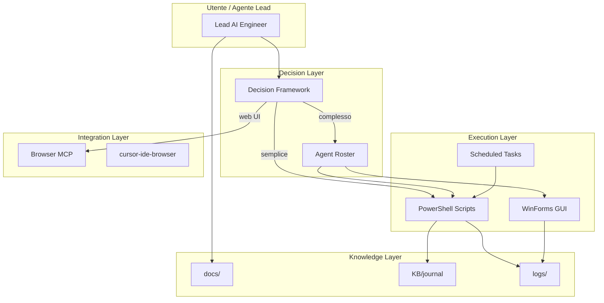

# Architettura Piattaforma — SystemOptimizerHub

## Visione

Ecosistema software per manutenzione intelligente **multi-piattaforma**: Windows (PowerShell/GUI), router DD-WRT (bash/SSH), documentazione e agenti AI su qualsiasi OS dev.

## Layer

### 1. Execution (esistente)

**Windows** — componenti PowerShell in [`KB/architecture.md`](../../KB/architecture.md):

**DD-WRT / router** — script bash e playbook [`KB/dd-wrt-hotspot-playbook.md`](../../KB/dd-wrt-hotspot-playbook.md):
- `scripts/ddwrt-apply-permanent-tuning.sh`
- `scripts/watchdog_wifi.sh`
- Wrapper PS: `scripts/apply-ddwrt-permanent-tuning.ps1`

Componenti Windows principali:

- Monitor risorse, cleanup storage, analisi compute/garbage
- GUI dashboard, task schedulati, packaging `dist/WindowsOptimizer`
- Pattern stabilità: UI busy gate, async worker, audit-first, rollback JSON

### 2. Decision

- [`docs/knowledge/decision-framework.md`](../knowledge/decision-framework.md) — routing per tipo di task
- [`docs/agents/roster.md`](../agents/roster.md) — decomposizione multi-agente

### 3. Integration (MCP)

| Strumento | Quando | Note |
|-----------|--------|------|
| Script/API locali | Default | PowerShell, WMI, Event Log, registry |
| cursor-ide-browser | Test UI web, snapshot DOM | Già disponibile in Cursor |
| stealth-browser-mcp | Portali protetti, anti-bot, login complessi | Opzionale; install separato |

### 4. Knowledge

| Store | Ruolo |
|-------|-------|
| `docs/` | Conoscenza strutturata permanente |
| `KB/journal.md` | Log operativo cronologico |
| `logs/*.json` | Stato rollback, KPI, audit |
| `docs/architecture/adr/` | Decisioni architetturali |

## Principi

1. **Audit-first** — osservare prima di modificare
2. **Rollback sempre** — JSON di stato prima di apply
3. **Minimal diff** — cambiamenti focalizzati
4. **Knowledge growth** — ogni fix → pagina KB
5. **No duplicate** — riusare pattern e script esistenti

## Evoluzione prevista

- **ADR-0007:** Core C# unico (`src/`) con adapter Windows/Linux — migration roadmap phased
- Runbook per ogni script critico con rollback
- Playbook per campagne (wave, post-reboot, WHEA)
- Checklist pre/post apply automatizzabili
- Agent skills Cursor per roster dominio

Vedi [`migration-roadmap.md`](migration-roadmap.md) e [`cross-platform-core.md`](cross-platform-core.md).
