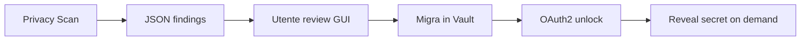

# SystemOptimizerHub — Product Vision

**Codename:** Active (`github.com/Pesach85/active`)  
**Versione target:** 3.x production  
**Principio guida:** *Audit-first, low cognitive load, zero regressioni*

---

## Problema

L'utente tecnico Windows ha bisogno di **un solo posto** per:

1. Capire lo stato del PC (spazio, salute, rischi)
2. Eseguire manutenzione **sicura** con rollback
3. Trovare **credenziali in chiaro** prima che diventino un incidente
4. Custodire segreti in un **vault locale** sbloccabile solo dopo autenticazione

Oggi la GUI WinForms (v2.1) funziona ma soffre di **overload cognitivo**: 12+ pulsanti sulla dashboard, tab poco gerarchici, monolite da 3.700 righe, exe ps2exe fragile su path/portabilità.

---

## Proposta di valore

| Per l'utente | Cosa fa Active |
|--------------|----------------|
| "Il PC è lento / pieno" | Scan storage + quick clean con tier Safe/Radical e rollback JSON |
| "Qualcosa non va" | Health audit + deep scan con fix graduati (Safe → Aggressive) |
| "Ho password ovunque" | Privacy scanner (read-only) → report → migrazione verso vault |
| "Voglio un exe portable" | Package `dist/WindowsOptimizer` con layout relativo e smoke test |

---

## Architettura moduli (v3)

```
┌─────────────────────────────────────────────────────────────┐
│  Console GUI (WinForms) — job-oriented, 4 azioni primarie │
├──────────────┬──────────────┬──────────────┬────────────────┤
│   Storage    │   Health     │   Privacy    │  Automation    │
│   engine     │   engine     │   engine     │  (tasks/logs)  │
├──────────────┴──────────────┴──────────────┴────────────────┤
│  hub-common.ps1 · sys-maintenance.json · logs/*.json        │
├─────────────────────────────────────────────────────────────┤
│  Vault (Phase 2): DPAPI + SQLite · unlock OAuth2 (MSAL)     │
└─────────────────────────────────────────────────────────────┘
```

### Engine esistenti (non toccare il contratto JSON)

- `analyze-garbage-hotspots.ps1`, `cleanup-storage-safe.ps1`, `quick-cleanup-safe.ps1`
- `system-health-audit.ps1`, `apply-safe-fixes.ps1`
- `monitor-resources.ps1`, `fs-integrity.ps1`, `hub-orchestrator.ps1`

### Engine nuovi

| Modulo | Script | Fase | Comportamento |
|--------|--------|------|---------------|
| Privacy Scanner | `privacy-scan-secrets.ps1` | **1** | Solo lettura; pattern credenziali; output JSON redatto |
| Secret Vault | `vault/` (stub) | **2** | DB cifrato locale; reveal solo post-OAuth2 |
| GUI shell | `scripts/gui/theme.ps1` | **1** | Tema estratto; tab Privacy; IA semplificata |

---

## UX — regole senior (basso carico cognitivo)

1. **Massimo 4 azioni primarie** visibili su Home: Health · Storage · Quick Clean · Privacy
2. **Strumenti avanzati** dietro pannello espandibile "More tools" (default chiuso)
3. **Un worker alla volta** — busy gate già presente, mantenerlo
4. **Linguaggio utente**, non nomi script: "Health Check" non "Run system-health-audit.ps1"
5. **Severità visiva** — Critical/Important/Moderate/Info coerente su tutti i tab
6. **Mai mostrare segreti in chiaro** in GUI/log — solo preview redatta + percorso

---

## Privacy & Vault — flusso target



**Fase 1 (ora):** Scan + report + raccomandazione "sposta in vault"  
**Fase 2:** Vault service Windows (LocalSystem/user scope) + MSAL OAuth2  
**Fase 3:** Auto-migrate assistito con backup rollback del file sorgente

---

## Definition of Done — production grade

- [ ] Smoke: `package-suite.ps1` + `build-gui-exe.ps1` + avvio exe da path non-C:
- [ ] Regression: health audit, garbage scan, quick clean producono JSON come prima
- [ ] Privacy scan: zero write su file scansionati; output in `logs/privacy-scan-latest.json`
- [ ] GUI v3: tab Privacy funzionante; Home con ≤4 CTA primarie
- [ ] Docs: ADR-0003, runbook privacy, roadmap con fasi
- [ ] Nessun secret in git (scanner esclude `ddwrtkey/`, `.git/`)

---

## Non obiettivi (out of scope v3.0)

- SaaS cloud / sync multi-device del vault
- Sostituire Bitwarden/1Password come password manager generico
- Rewrite completa GUI in WPF/WinUI (valutare v4)
- Scan rete / pentest aggressivo
