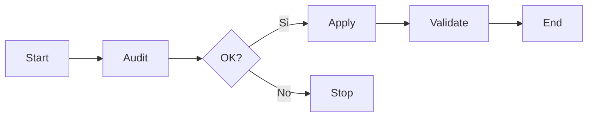

# Runbook Template

**ID:** RB-XXXX  
**Titolo:**  
**Stato:** Draft | Active | Deprecated  
**Ultimo aggiornamento:** YYYY-MM-DD  
**Owner:**  

## Scopo

Breve descrizione di cosa fa questa procedura e quando usarla.

## Prerequisiti

- [ ] PowerShell Core installato
- [ ] Privilegi amministratore (se richiesto)
- [ ] Backup/rollback state verificato
- [ ] Finestra manutenzione (se reboot)

## Diagramma flusso



## Procedura

### 1. Audit (obbligatorio)

```powershell
# comando audit
```

### 2. Apply

```powershell
# comando apply
```

### 3. Validazione

```powershell
# comando verify
```

## Rollback

```powershell
# comando rollback
```

**Rollback state:** `logs/<nome>-rollback.json`

## Troubleshooting

| Sintomo | Causa probabile | Azione |
|---------|-----------------|--------|
| | | |

## Checklist post-esecuzione

- [ ] Log verificato
- [ ] Metriche pre/post confrontate
- [ ] KB journal aggiornato
- [ ] Rollback testato (dry-run)

## Riferimenti

- Script: `scripts/`
- Architecture: `docs/architecture/overview.md`
- ADR correlati:
